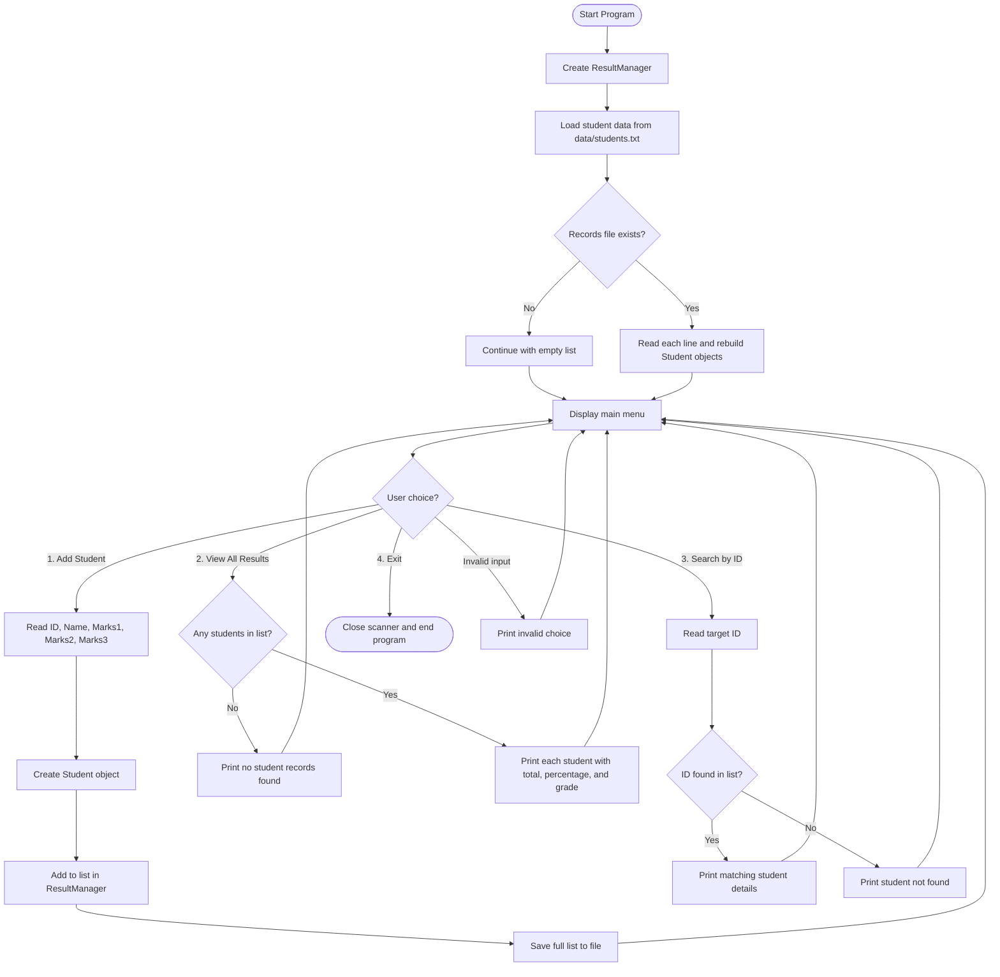

# 🎓 Student Result Management System

<div align="center">

[](https://www.oracle.com/java/)
[](https://en.wikipedia.org/wiki/Object-oriented_programming)
[](https://docs.oracle.com/javase/8/docs/technotes/guides/collections/overview.html)
[](https://docs.oracle.com/javase/8/docs/api/java/util/Scanner.html)
[](#)

<h3>📚 A clean, beginner-friendly Java console project for managing student marks, grades, and results.</h3>

</div>

---

## 🌟 Overview

<table>
  <tr>
    <td width="33%"><b>🎯 Purpose</b><br/>Manage student records with a menu-driven workflow and persistent storage.</td>
    <td width="33%"><b>🧠 Learning Focus</b><br/>Practice OOP design, collections, file handling, and console I/O in one project.</td>
    <td width="33%"><b>⚙️ Practical Value</b><br/>A strong starter architecture for future JavaFX or database-based upgrades.</td>
  </tr>
</table>

> On startup, the app loads saved records (if present), then runs a continuous menu loop for adding, viewing, searching, and exiting.

---

## ✨ Features (Styled Cards)

| Feature | Description |
|---|---|
| 📌 **Add Student** | Capture student ID, name, and 3 subject marks. |
| 🧮 **Auto Calculation** | Automatically computes total marks and percentage. |
| 🏅 **Grade Engine** | Assigns grade as `A`, `B`, `C`, or `Fail` based on percentage. |
| 📋 **View All Results** | Displays every saved student result in a readable format. |
| 🔍 **Search by ID** | Finds a specific student record quickly using unique ID. |
| 💾 **Persistent Save** | Saves the latest records to file whenever a new student is added. |
| 🔄 **Auto Load on Start** | Loads existing records from file when the app launches. |

---

## 🧱 Project Structure

```text
Student-Result-Management-System/
├── README.md
├── run.bat
└── src/
    ├── Main.java          # Program entry point + menu loop
    ├── ResultManager.java # Student list management + file read/write
    └── Student.java       # Student model + total/percentage/grade logic
```

---

## 🔄 Detailed Application Flow (Mermaid)



### 🧠 Flow Explanation (Step-by-Step)

1. **Program startup**  
   `Main` creates `ResultManager`, which immediately triggers data loading.

2. **Data loading**  
   If `data/students.txt` exists, lines are parsed into `Student` objects; otherwise the app starts with an empty list.

3. **Menu loop begins**  
   User sees options to add, view, search, or exit.

4. **Add Student path**  
   User inputs ID, name, and marks → new student object is created → list is updated → file is rewritten.

5. **View Results path**  
   If list is empty, a friendly message is printed; otherwise all result rows are shown.

6. **Search path**  
   User enters an ID; the app checks list entries and prints either matching details or not-found output.

7. **Exit path**  
   Scanner is closed and the program terminates cleanly.

---

## ▶️ Run the Project

### 1) Using Any Java IDE
1. Clone this repository.
2. Open the project in IntelliJ / Eclipse / VS Code.
3. Run `src/Main.java`.

### 2) Using Command Line
```bash
javac src/*.java
java -cp src Main
```

### 3) Windows Quick Run
- Double-click `run.bat`.

---

## 🛠️ Tech Stack (Visual Style)

| Layer | Tools / Concepts | Role in Project |
|---|---|---|
| **Language** |  | Core implementation language |
| **Design** |  | Encapsulation with classes (`Student`, `ResultManager`, `Main`) |
| **Data Handling** |  | In-memory storage of student records |
| **Input** |  | Menu and user data capture |
| **Persistence** |  | Save/load records via readers and writers |

---

## 🔮 Future Improvements

- ✅ Store and recover **individual subject marks** exactly (instead of recalculation)
- ✅ Add validation for invalid/non-numeric user input
- ✅ Add sorting/filtering views (topper list, grade-wise reports)
- ✅ Add database layer (**MySQL** / **SQLite**)
- ✅ Build a GUI version with **JavaFX**

---

## 📌 Why This Project Is Useful

- Great for Java beginners learning class design and method separation
- Demonstrates a complete end-to-end console workflow
- Shows practical use of file persistence before introducing databases
- Serves as a strong base project for advanced Java application development

---

<div align="center">

⭐ If you found this project useful, consider starring the repository.

</div>

